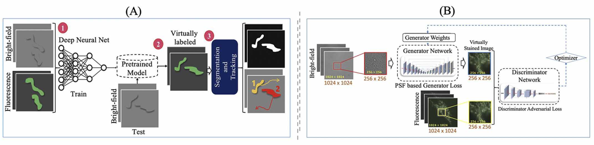

**[Virtual Labeling of Mitochondria in Living Cells using Correlative Imaging and Physics-guided Deep Learning
](https://opg.optica.org/boe/abstract.cfm?uri=boe-13-10-5495)**
<br />
[Ayush Somani](http://www.ayushsomani.com), 
[ARIF AHMED SEKH](https://skarifahmed.github.io/), 
[IDA S. OPSTAD](https://en.uit.no/ansatte/person?p_document_id=472778),
[ÅSA BIRNA BIRGISDOTTIR](https://en.uit.no/ansatte/person?p_document_id=41975),
[TRULS MYRMEL](https://en.uit.no/ansatte/person?p_document_id=41762),
[BALPREET SINGH AHLUWALIA](https://en.uit.no/ansatte/person?p_document_id=44202),
[ALEXANDER HORSCH](https://en.uit.no/ansatte/alexander.horsch),
[KRISHNA AGARWAL](https://sites.google.com/site/uthkrishth/krishnaagarwal), and
[DILIP K. PRASAD](https://sites.google.com/site/dilipprasad/home)
<br />
In Biomedical Optics Express (BOE) 2022
<br />
[[Paper]](https://opg.optica.org/boe/abstract.cfm?uri=boe-13-10-5495)
[[BibTex]](_assets/boe-13-10-5495.bib)

This is the code for Virtual Labeling of Mitochondria in Living Cells using Correlative Imaging and Physics-guided Deep Learning. Figure (A) outlines the proposed method. The red coloured numbers represent the principal modules and their sequence, and Figure (B) conditional GAN of the employed architecture.
The details of the architecture are presented in section 2.3.

<div align="center">
  
</div>


This code in this repository can be used to run training and inference of our model on a single machine, and can be adapted for distributed training. 
This README will explain how to:

## 🔬 Data Availability
The data is made available through UiT public repository for large datasets, Dataverse: ``` [To-be-Updated] ```

## 💻 Citing the code

If you use this code, please cite our paper:<br>
```
Ayush Somani, Arif Ahmed Sekh, Ida S. Opstad, Åsa Birna Birgisdottir, Truls Myrmel, Balpreet Singh Ahluwalia, Alexander Horsch, Krishna Agarwal, and Dilip K. Prasad, "Virtual labeling of mitochondria in living cells using correlative imaging and physics-guided deep learning," Biomed. Opt. Express 13, 5495-5516 (2022)
```

📑 BibTeX:

```bibtex
@article{somani2022virtual,
  title={Virtual Labeling of Mitochondria in Living Cells using Correlative Imaging and Physics-guided Deep Learning},
  author={Somani, Ayush and Sekh, Arif Ahmed and Opstad, Ida S and Birgisdottir, {\AA}sa Birna and Myrmel, Truls and Ahluwalia, Balpreet Singh and Agarwal, Krishna and Prasad, Dilip K and Horsch, Alexander},
  journal = {Biomed. Opt. Express},
  number = {10},
  pages = {5495--5516},
  publisher = {Optica Publishing Group},
  year={2022},
  volume = {13},
  month = {Oct},
  year = {2022},
  publisher = {Optica Publishing Group},
  url = {http://opg.optica.org/boe/abstract.cfm?URI=boe-13-10-5495},
  doi = {10.1364/BOE.464177},
}
```

## Prerequisites

- Python 3
- PyTorch 1.0.1 or higher, with NVIDIA CUDA Support
- Tensorflow 1.10.0 or higher
- Other required python packages specified by `requirements.txt`. See the Installation.

## Installation

Clone this repository:

```
git clone https://github.com/AyushSomani001/VirtualStain_I2I.git
```

Create a conda environment for VS, and install the requirements. This includes the required python packages
from `requirements.txt`. Most of the required packages have been included in the built-in `anaconda` package:

```
conda create -n VS anaconda
conda activate VS
```

Install all the dependencies and libraries associated with the conda environment:

```
conda install python=3.5
conda install requirement.txt
```

## Dataset preparation

To replicate the experiments, you need to prepare your dataset as the following. Taking the Microscopy dataset as an example and creating just the training and test set split.

```
Microscopy
├── train_A
│   └── images (Contains BrightField images)
├── train_B
│   └── images (Contains Fluroscent counterpart images)
├── test_A
│   └── images
└── test_B
    └── images
```


## 📌 Acknowledgments
This code extensively draws inspiration from [pytorch-CycleGAN-and-pix2pix](https://github.com/junyanz/pytorch-CycleGAN-and-pix2pix).

## 📧 Contact the Author
 ayush[dot]somani[at]uit.no
